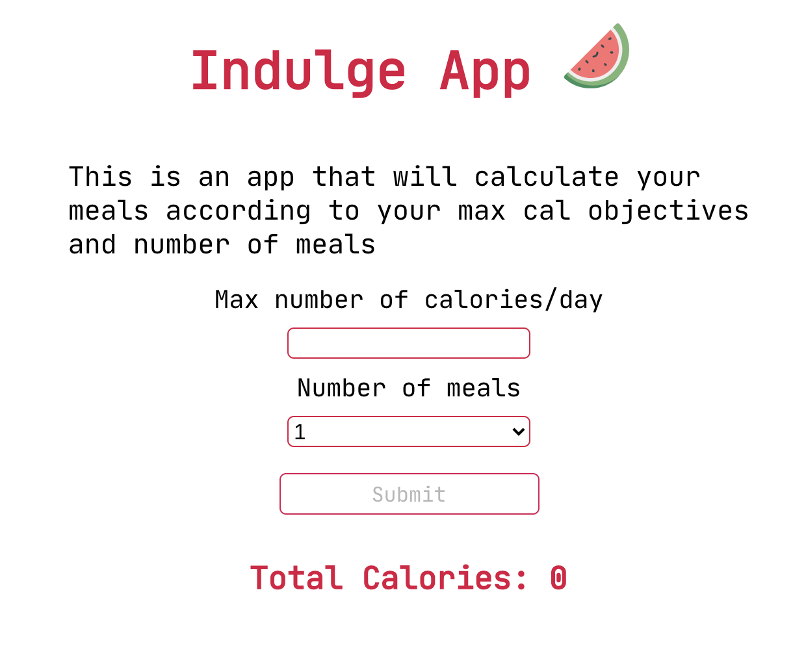

# Indulge 🍉🥑🍕🧁

This is a meal planning tool.

## Motivation

My learning journey started in January 2019. This app was built
after 3 month of learning.
It provided a way to improve and learn even more.

## Screenshot

## How it works?

- go to [Indulge App](https://indulgeapp.netlify.app/)
- type the number of calories
- select the number of meals
- Indulge will provide the meal plan!🤩

## Tech stack 👩‍💻
<code> 
</code>

### `npm start`

Runs the app in the development mode. 
Open [http://localhost:3000](http://localhost:3000) to view it in the browser.
